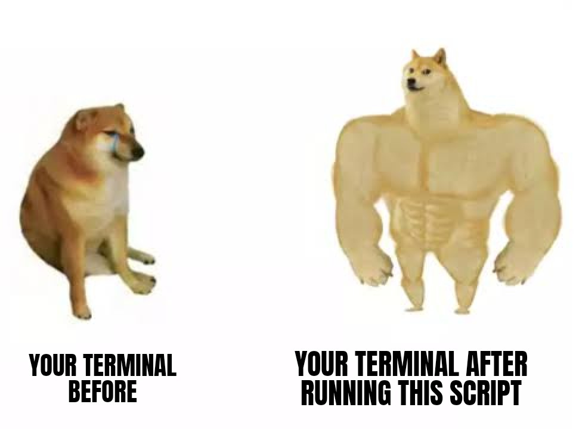
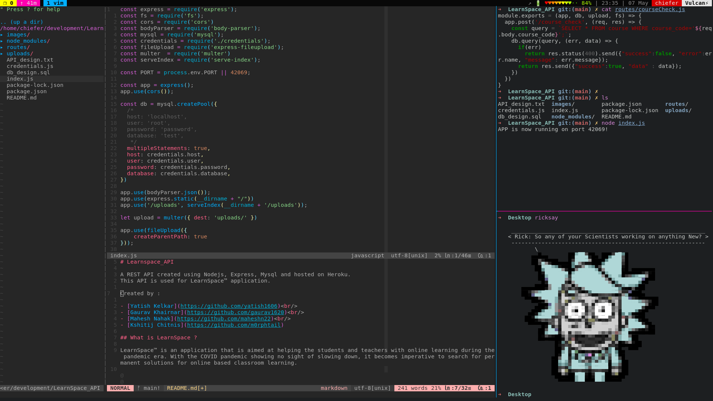
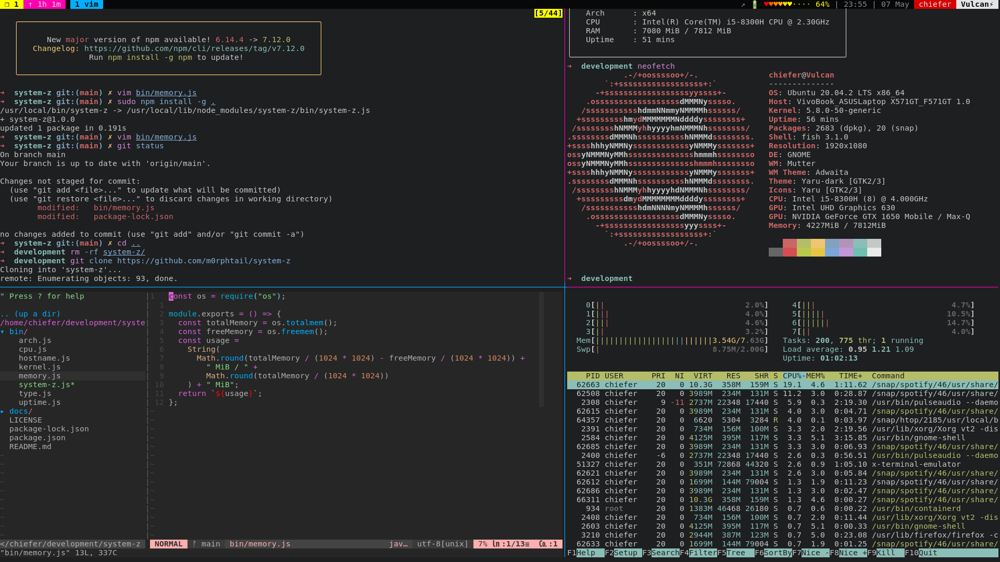
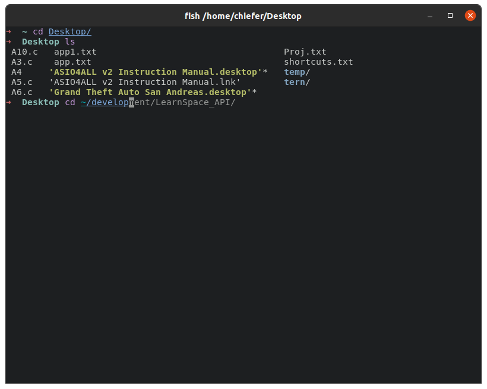

## Buffed Terminal
<br>

To get a aesthetic coding environment along with 1000+ customizations right into your terminal just execute the following line of code after cloning this repository.<br>
```
$ bash script.sh
```

#### Features
  - You will be using the fastest terminal ever made ie. Alacritty. With it you will also get Alacritty's default features like Vi mode, Selection, Visual mode etc.
  - Fish shell will be used with a custom theme along with features like autosuggestions, tab to autocomplete, 256 terminal colors, UTF-8 support, fish script etc
  - Vim will be configured along with Vundle, dracula theme, a cool Vim lightline and many more customizations. Few extra customizations include:
    - Tab      : autocomplete
    - Ctrl + t : Create a new tab.
    - Ctrl + z : Close the current tab.
    - Ctrl + s : Go to the next tab.
  - Tmux with a custom top bar which has time, battery, uptime and other icons.
  - Cat command will be syntax highlighted
  <br><br>
#### How to customize more
  - Customize your prompt and shell using the "fish_prompt" command. This will open a user friendly web based page to customize the shell.
  - To customize vim, you need to edit the '.vimrc' file located in user folder.
  - To further customize tmux edit the 'tmux.conf' and 'tmux.conf.local' files in the user folder.

<br><br>
<br><br>

